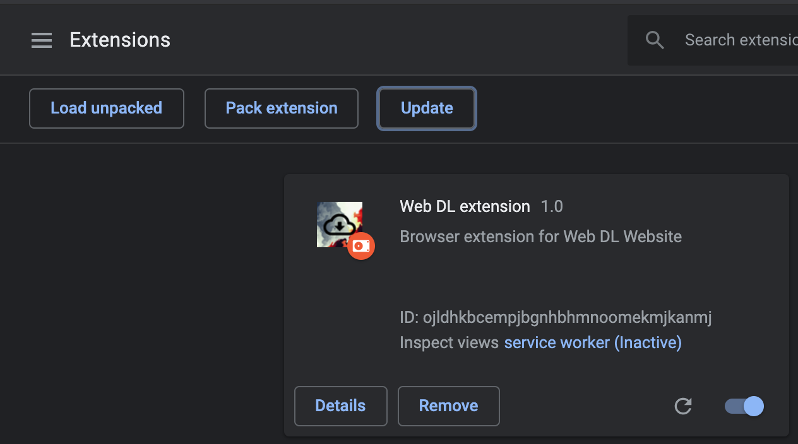

# Web DL Extension

**Web DL Extension** is a Google Chrome extension build to allow quick download links.
It's the official browser extension for the Web DL stack.

### Some features
* Link with Web DL website.
* Allow quick download for the active tab.
* Allow quick download for highlighted hyperlinks.

## Configuration
Configuration for the Web DL Extension is managed by Chrome extension options.
Please go to the extension options page and fill in the values.

| Property              | Description                            | Required | Example                                               |
|-----------------------|----------------------------------------|----------|---------------------|
| **Website URL**       | The url of Web Dl website              | Yes      | http://localhost                                                     |

## Installation
The Wel DL Extension requires the following software to be installed:

- [Google Chrome](https://www.google.com/chrome/)

Installation instructions to follow.

## Development
For development the Web DL Extension requires the same stack to be installed as for installation.
No additional software is required.

1. Go to [Chrome Extensions](chrome://extensions)
2. Enable developer mode (top right)
3. Click on "Load unpacked"
4. Load the repository folder
